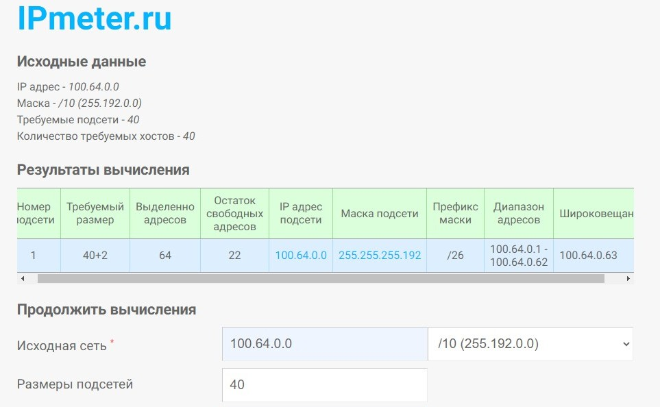

# Домашнее задание к занятию "3.7. Компьютерные сети, лекция 2"

(1) Проверьте список доступных сетевых интерфейсов на вашем компьютере. Какие команды есть для этого в Linux и в Windows?

*Решение:*

Linux

```
root@vagrant:~# ip -c -br link
lo               UNKNOWN        00:00:00:00:00:00 <LOOPBACK,UP,LOWER_UP>
eth0             UP             08:00:27:b1:28:5d <BROADCAST,MULTICAST,UP,LOWER_UP>
```

Windows

```
PS C:\Windows\system32> Get-NetAdapter

Name                      InterfaceDescription                    ifIndex Status       MacAddress             LinkSpeed
----                      --------------------                    ------- ------       ----------             ---------
Ethernet                  Qualcomm Atheros AR8172/8176/8178 PC...      10 Disconnected D8-97-BA-08-C5-69          0 bps
Беспроводная сеть         Qualcomm Atheros AR9485WB-EG Wireles...      12 Up           30-10-B3-7A-C0-92       150 Mbps
Сетевое подключение Bl... Bluetooth Device (Personal Area Netw...      14 Disconnected 30-10-B3-7A-E7-A2         3 Mbps
VirtualBox Host-Only N... VirtualBox Host-Only Ethernet Adapter         3 Up           0A-00-27-00-00-03         1 Gbps
Ethernet 2                Kaspersky Security Data Escort Adapter        6 Disconnected 00-FF-1E-A2-96-8A       100 Mbps
```

(2) Какой протокол используется для распознавания соседа по сетевому интерфейсу? Какой пакет и команды есть в Linux для этого?

*Решение:*

Для этого используется команда lldpctl из пакета LLDP. Странно, но у меня эта команда ничего не показывает.

```
root@vagrant:~# systemctl enable lldpd && systemctl start lldpd
Synchronizing state of lldpd.service with SysV service script with /lib/systemd/systemd-sysv-install.
Executing: /lib/systemd/systemd-sysv-install enable lldpd
root@vagrant:~# lldpctl
-------------------------------------------------------------------------------
LLDP neighbors:
-------------------------------------------------------------------------------
root@vagrant:~#
```

(3) Какая технология используется для разделения L2 коммутатора на несколько виртуальных сетей? Какой пакет и команды есть в Linux для этого? Приведите пример конфига.

*Решение:*

Для этого есть пакет VLAN. Пример конфига:

```
root@vagrant:~# cat /etc/network/interfaces
auto eth0.1400
iface eth0.1400 inet static
        address 192.168.1.1
        netmask 255.255.255.0
        vlan_raw_device eth0
```

(4) Какие типы агрегации интерфейсов есть в Linux? Какие опции есть для балансировки нагрузки? Приведите пример конфига.

*Решение:*

Типы агрегации интерфейсов в Linux

Bonding – это объединение сетевых интерфейсов по определенному типу агрегации, Служит для увеличения пропускной способности и/или отказоустойчивость сети.

Типы агрегации интерфейсов в Linux:

Mode-0(balance-rr) – Данный режим используется по умолчанию. Balance-rr обеспечивается балансировку нагрузки и отказоустойчивость. В данном режиме сетевые пакеты отправляются “по кругу”, от первого интерфейса к последнему. Если выходят из строя интерфейсы, пакеты отправляются на остальные оставшиеся. Дополнительной настройки коммутатора не требуется при нахождении портов в одном коммутаторе. При разностных коммутаторах требуется дополнительная настройка.

Mode-1(active-backup) – Один из интерфейсов работает в активном режиме, остальные в ожидающем. При обнаружении проблемы на активном интерфейсе производится переключение на ожидающий интерфейс. Не требуется поддержки от коммутатора.

Mode-2(balance-xor) – Передача пакетов распределяется по типу входящего и исходящего трафика по формуле ((MAC src) XOR (MAC dest)) % число интерфейсов. Режим дает балансировку нагрузки и отказоустойчивость. Не требуется дополнительной настройки коммутатора/коммутаторов.

Mode-3(broadcast) – Происходит передача во все объединенные интерфейсы, тем самым обеспечивая отказоустойчивость. Рекомендуется только для использования MULTICAST трафика.

Mode-4(802.3ad) – динамическое объединение одинаковых портов. В данном режиме можно значительно увеличить пропускную способность входящего так и исходящего трафика. Для данного режима необходима поддержка и настройка коммутатора/коммутаторов.

Mode-5(balance-tlb) – Адаптивная балансировки нагрузки трафика. Входящий трафик получается только активным интерфейсом, исходящий распределяется в зависимости от текущей загрузки канала каждого интерфейса. Не требуется специальной поддержки и настройки коммутатора/коммутаторов.

Mode-6(balance-alb) – Адаптивная балансировка нагрузки. Отличается более совершенным алгоритмом балансировки нагрузки чем Mode-5). Обеспечивается балансировку нагрузки как исходящего так и входящего трафика. Не требуется специальной поддержки и настройки коммутатора/коммутаторов.

```
root@vagrant:~# ifconfig
bond0: flags=5123<UP,BROADCAST,MASTER,MULTICAST>  mtu 1500
        ether 06:f7:a4:bb:32:f2  txqueuelen 1000  (Ethernet)
        RX packets 0  bytes 0 (0.0 B)
        RX errors 0  dropped 0  overruns 0  frame 0
        TX packets 0  bytes 0 (0.0 B)
        TX errors 0  dropped 0 overruns 0  carrier 0  collisions 0

eth0: flags=4163<UP,BROADCAST,RUNNING,MULTICAST>  mtu 1500
        inet 10.0.2.15  netmask 255.255.255.0  broadcast 10.0.2.255
        inet6 fe80::a00:27ff:feb1:285d  prefixlen 64  scopeid 0x20<link>
        ether 08:00:27:b1:28:5d  txqueuelen 1000  (Ethernet)
        RX packets 16587  bytes 13388877 (13.3 MB)
        RX errors 0  dropped 0  overruns 0  frame 0
        TX packets 13788  bytes 2228627 (2.2 MB)
        TX errors 0  dropped 0 overruns 0  carrier 0  collisions 0

lo: flags=73<UP,LOOPBACK,RUNNING>  mtu 65536
        inet 127.0.0.1  netmask 255.0.0.0
        inet6 ::1  prefixlen 128  scopeid 0x10<host>
        loop  txqueuelen 1000  (Local Loopback)
        RX packets 134  bytes 12952 (12.9 KB)
        RX errors 0  dropped 0  overruns 0  frame 0
        TX packets 134  bytes 12952 (12.9 KB)
        TX errors 0  dropped 0 overruns 0  carrier 0  collisions 0
```

(5) Сколько IP адресов в сети с маской /29 ? Сколько /29 подсетей можно получить из сети с маской /24. Приведите несколько примеров /29 подсетей внутри сети 10.10.10.0/24.

*Решение:*

В сети с маской /29 - 6 + 2 адреса (network и broadcast). В сети с маской /24 - 254 + 2 адреса (network и broadcast). Подсеть 10.10.10.0/24 может содержать 32 подсети с маской /29. Например: 10.10.10.0/24, 10.10.10.8/24, 10.10.10.16/24 и т.д. до 10.10.10.248/24

(6) Задача: вас попросили организовать стык между 2-мя организациями. Диапазоны 10.0.0.0/8, 172.16.0.0/12, 192.168.0.0/16 уже заняты. Из какой подсети допустимо взять частные IP адреса? Маску выберите из расчета максимум 40-50 хостов внутри подсети.

*Решение:*

Почитав документацию, из всего списка немаршрутизируемых в Интернет адресов ну хоть как-то подходит для наших целей сеть 100.64.0.0/10.




(7) Как проверить ARP таблицу в Linux, Windows? Как очистить ARP кеш полностью? Как из ARP таблицы удалить только один нужный IP?

*Решение:*

Посмотреть таблицу ARP записей можно через:

arp -n

Полностью очистить ARP кэш можно командой:

ip -s -s neigh flush all

Через команду arp нельзя почистить весь кэш, а только для конкретного IP:

arp -d 192.168.1.2

Чтобы удалить IP адрес из интерфейса надо использовать команду del. Например, удалим IP адрес 10.0.2.100:

ip addr del 10.0.2.100/255.255.255.0 dev 'Iface'

Просмотр ARP таблицы в Windows:

```
C:\Windows\system32>arp -a

Интерфейс: 192.168.56.1 --- 0x3
  адрес в Интернете      Физический адрес      Тип
  192.168.56.255        ff-ff-ff-ff-ff-ff     статический
  224.0.0.22            01-00-5e-00-00-16     статический
  224.0.0.251           01-00-5e-00-00-fb     статический
  224.0.0.252           01-00-5e-00-00-fc     статический
  239.192.152.143       01-00-5e-40-98-8f     статический
  239.255.255.250       01-00-5e-7f-ff-fa     статический

Интерфейс: 192.168.1.83 --- 0xc
  адрес в Интернете      Физический адрес      Тип
  192.168.1.1           50-ff-20-51-4f-70     динамический
  192.168.1.76          58-00-e3-7e-ad-bb     динамический
  192.168.1.149         7c-1c-4e-84-41-44     динамический
  192.168.1.255         ff-ff-ff-ff-ff-ff     статический
  224.0.0.22            01-00-5e-00-00-16     статический
  224.0.0.251           01-00-5e-00-00-fb     статический
  224.0.0.252           01-00-5e-00-00-fc     статический
  239.192.152.143       01-00-5e-40-98-8f     статический
  239.255.255.250       01-00-5e-7f-ff-fa     статический
  255.255.255.255       ff-ff-ff-ff-ff-ff     статический
```
